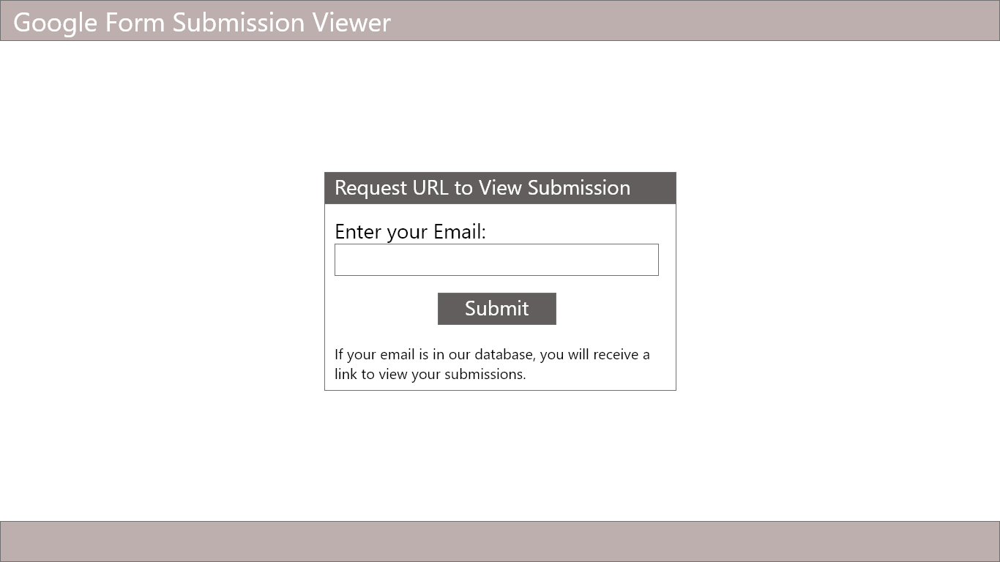
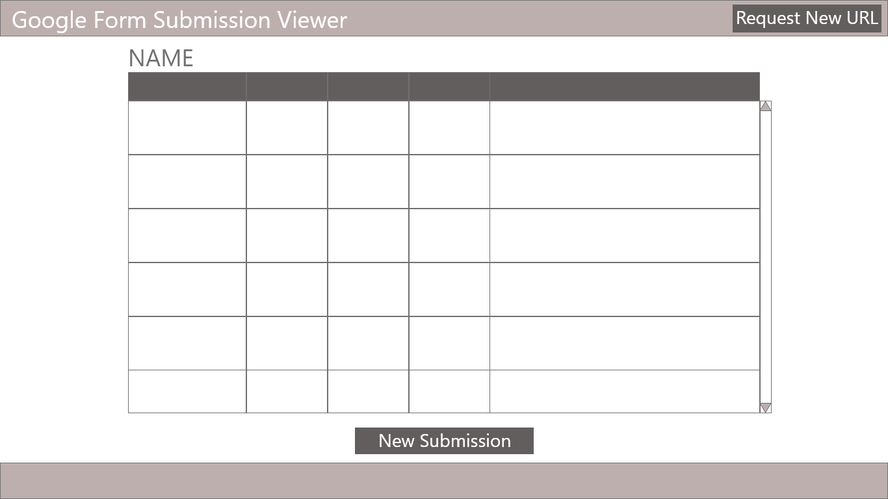
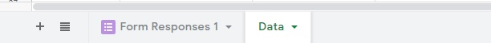
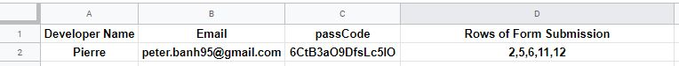

# Google-Form-Submission-Viewer
1. [Introdution](##1.-Introduction)
2. [Project Requirements](##2.-Project-Requirements)
3. [Google Form Submission Reviewer](##3.-Google-Form-Submission-Reviewer)
4. [Wireframe](##4.-Wireframe)
5. [Psuedocode](##5.-Psuedocode)
6. [Project Content](##6.-Project-Content)
7. [Implementing Solution](##7.-Implementing-Solution)

## 1. Introduction
The Google Form works well as a tool to collect data from it's user, however it can be quite challenging for a user to view their submission especially when the feature for the an email reply is turned off.

While this issue can be resolved by having the google form send a user the response receipt, the user may still find it challenging to sift through their email the reply from the google from.

As a result, this markdown will detail a web app solution to allow users to view their google form submissions all in one place.

## 2. Project Requirements
The Web App solution must include the following:
- When displaying the results of a google form, the user accessing the web app must only see the results they submit.
- Work with the Google Spreadsheet API that contains the data from the Google Form
- Results must be presented in a chronological order
- Results must be easily viewed

## 3. Google Form Submission Reviewer
The proposed Google Form Submission Reviewer will consists of three parts:
- The Google Spreadsheet that will act as the database and hold the submission data.
- The Google Script code is the server side code that the client will call.
- The HTML files that will be sent to the client to display the web app solution. These HTML files will also contain the style files and script files because it will be served through Google's App Script platform which only accepts HTML files.

### 3.1 The Google Spreadsheet
The google spreadsheet will contain the submission data from the form in the Form Response tab. Each row in this tab represent a submission. A user wil not require all this data, they will only need specific data.  Therefore we will need to grab the data we want for a specifc user. Therefore there will be a second tab which will specify what rows of data belong to a user. This second sheet shall also have the email of the user and a unique ID generated by the GS code.

### 3.2 Google Script
The Google Script will serve as the server side code to organize the data, and to send it over to the client side.

### 3.3 HTML Files
The HTML file will consist of two pages, one for the user to sign up to view the google form data. This will consist of a form to allow user to enter an email so that they can receieve an url to view the form data.

The second will be a table to show all the data specifc to the user.

## 4. Wireframe
Mockups of the Web App solution are presented below.

In the first image above, this page will be used by the user to enter their email and receieve a url to view their submissions if their email is in the database. 

In the second image, pictured above, this page will be used by the user to view their submission. If the URL they entered is invalid, this webpage will show nothing.

## 5. Pseudocode 
### Google Script Function
- For every form submission, find who submitted the data, and then update the data tab. Add the new row number to the respective user. In order to ensure the data is up to date, rather than just add a new number to the original list, the list should be re-made everytime in case there were any changes to the database.
- When doGET() runs, it will serve the HTML data. Depending on the parameter present, it will display different HTML files.
- When the web page for viewing submission is accessed, the client will send some passcode to a google script function, and then function will check if the passcode exists in the database. If it does it will send the data corresponding to the user that has that passcode back to the client. 
- When the web page for users to request an url is accessed, users can run a function to first have the database check for the email, if it exists, a random 15 letter character is generated, assigned to the email, and then a url with the random 15 characters is sent to the email. If it doesn't exist the function just returns false.
### For User to View - Require Parameters
- When the HTML file is served, wait until the HTML is served and then run Javascript file to extract data.
- Once data returns create new DOM nodes and fill the table for user to view data. If no data is returned, update the DOM accordingly.
### For Users to Submit Email - No Parameter
- Send the form object to server side GS code, then send an email.
- Update the DOM to notify users email will be sent or if an email is invalid.

## 6. Project Content
With the release of the initial working version, the project consists of the following files:

### Google Apps Script Files (*.gs)
- Main.js - Contains general functions called out by the other functions, or used to serve HTML files.
- Form Submission.Js - Contains a function that runs when a google form is submitted to the user. This function will go through the form responses, find all the developer names, and then create a list of the row indexes of the form responses that correspond to each developer.
- APIS.js - Contains two functions that is called by the client, when visiting the web pages. dataRetrieve is to retrieve data from the google spreadsheet based on a passCode that is randomly generated and appended to the url of website as a parameter. A unique passcode is assigned to every user after they have it generated. The urlGen function is to generate a url for the user to view their submissions.

### Web Page to Generate URL(*.html)
When a user visits this web page, they will be served these three files. This is the web page that allows a user to generate a url to view their google form submissions.
- index.html
- indexStyle.html
- indexScript.html

### Web Page to view Google Form Submissions(*.html)
When a user visits this web page, they will be served these three files. This is the web page to view the google form submissions based on a passcode that is submitted as a parameter.
- userData.html
- userDataStyle.html
- userDataScript.html

## 7. Implementing Solution
If there is a Google Form that has users submitting the form multiple time, and there is a need for the users to view all their submissions, then this solution can be implemented, as long as the following are met:

- The html files and gs files have been implemented into the Google Apps Script of the google spreadsheet. It is suggested to use [Google Clasp](https://github.com/google/clasp/)to complete this action, otherwise the copy may just be copied and pasted in.
- The form has the user entering an id that is always the same for every submission.
- In the spreadsheet another tab is added named "Data" along with the Form Response Tab. If the file names are different, then change the variable "formResponseSheet" and "dataSheet" in Main.js accordingly, they are global variables.

- In the Data Sheet, ideally the data should have the headings shown in Row 1 of the following image. The order of the heading does not have to be the same. If for whatever reason, the heading names have to be changed, these changes need to be captured in the global variable in Main.js. Please note that both sheets, the "formResponseSheet" and the "dataSheet" must have the identical row heading of "Developer Name" or whatever is prefered for the user's name.

- When the data tab has been created, and the headings have been created, if there have been form submissions already, either run the formSubmission function once or wait another user submits the form again. This will determine which rows belong to which user. 

- In the Google Apps Script platform, under publish, deploy the code as web app.

- Copy the web app url and change the anchor link in userData.html for the "Request New Url" button. Also, change the anchor link for the "New Submission" button to the form that is currently being used.

- In the Google Apps Script platform, under publish, deploy the code as web app again with a new project version.

- Once that has been completed, enter each user's emails, and at this point this may now visit the page for url generation.

## 8. Demo
See the following for a Demo

- URL Generation: https://script.google.com/macros/s/AKfycby-eKCuqc6SaQHpa9-K7_G2Rgzi2ss2A4ChAfNxfdkBjXY7SZ8_/exec
- Submission Viewer: https://script.google.com/macros/s/AKfycby-eKCuqc6SaQHpa9-K7_G2Rgzi2ss2A4ChAfNxfdkBjXY7SZ8_/exec?passCode=KzvjTJcFnVhrBEhH
- Spreadsheet: https://docs.google.com/spreadsheets/d/1VDxhB6jM43WjXDx5-TdfrA-bmpGcX4MTusMkeawQHdM/edit?usp=sharing